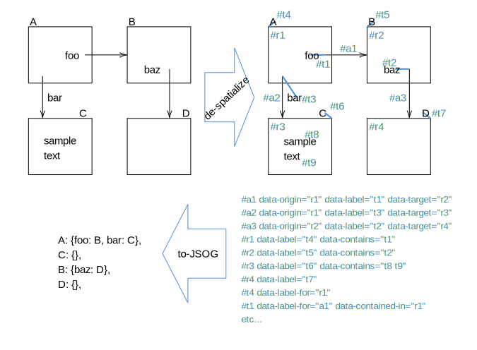
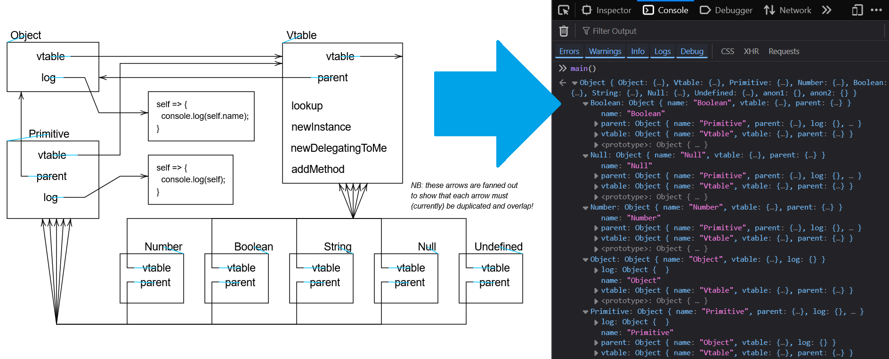
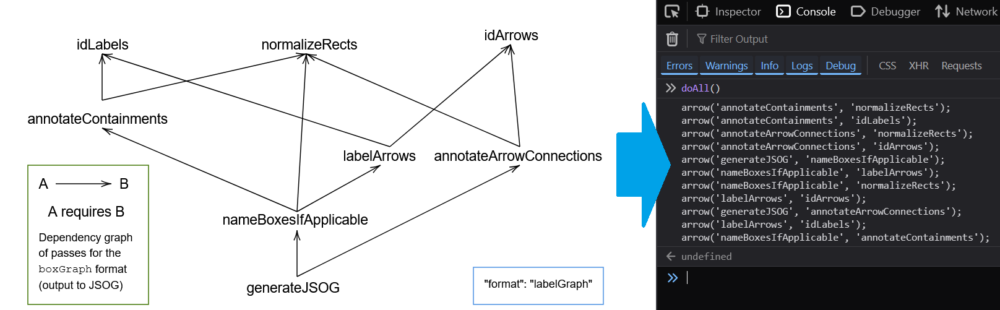

# Self-Raising Diagrams
A text file is a static medium. Source code is self-raising text: the static text raises itself into a dynamic run-time environment (usually unvisualised).

A vector graphics diagram is a static medium. A self-raising diagram is a generalisation of source code: it raises itself into a dynamic run-time environment, this time with an obvious visualisation.

We take advantage of *existing* drawing tools to draw the diagrams, just as we take advantage of *existing* text editors to write code (even to write our own custom syntaxes). This sidesteps the classic trap of having to implement your own (crappy) custom drawing software just to get the precise notational semantics that you want. Imagine if you always had to build your own text editor just to use your domain-specific syntax!

We outsource the drawing to drawing experts, and encode dynamic behaviour in the diagram somehow (just like source code somehow encodes the dynamic behaviour in the syntax). The shapes get drawn and placed in software *optimised* for drawing; all the rest is performed by multiple compilation passes from diagram to diagram, or interpretation of the diagram in a run-time environment. *This* is the part that is actually interesting to us as notational engineers - *not* coding line rubberbanding event handlers for the umpteenth time.

It is futile to expect to reinvent Adobe Illustrator in Squeak Smalltalk in order to draw beautiful GUIs. Just use Adobe Illustrator itself to make a beautiful schematic, with embedded instructions for responding to change, and load this into your favourite environment as if it were source code.

In this project, I draw in [Mathcha.io](https://www.mathcha.io/editor) and output to (horrible) SVG. The SVG shall raise itself into a dynamic web app in the web browser.

# Between Parsing and Computer Vision
Self-raising diagrams sit at a "sweet spot" between the ubiquitous tech of string parsing and the advanced field of Computer Vision. Sophisticated  CV (including AI) would be needed to parse *raster* images made of pixels. However, if you're drawing a diagram in computer software, the sofware already knows all the relevant information about your shapes, and if it outputs to a vector format, you can take advantage of it without needing any CV or AI at all! Just a daunting, unexplored territory of *diagram parsing* - which I'm charting in this project.

(If all goes well, I'll end up with diagrammatic notations for diagram parsing, all the way down.)

# Object vs Meta Graphics
Some parts of the diagram are object-level: they're part of the intended output. Other parts (perhaps in a designated meta-colour, like blue) are instructions to the next transformation pass to alter the diagram in some way (add stuff, remove stuff, etc). Sorta like macros. Example:


The idea here is: we look for a rectangle whose border is the special meta-colour, and collect the `<text>`s inside it into a JSON object. We use the `format` key to understand which passes understand this diagram (and are safe to run on it). The `labelGraph` format parser will know that the green rectangle is a comment box (to be ignored) by virtue of its specific border colour, and will interpret these shapes differently to `boxGraph`.

# Current instructions
Currently, we recognise a simple visual notation of boxes, arrows, and text labels (the "`boxGraph`" format). An arrow is labelled by the text element closest to its origin point. A text element not attached to an arrow may name a nearby box, if it is close enough. Each box means a JS object, and each arrow means a property, with the "obvious" semantics on that. The JS object will have its `name` property set to the box's name if it has one.



If providing your own SVG file, you need to insert the following into it, below the top svg element:

```html
<script href="./passes.js"></script>
<script href="./boxGraph.js"></script>
or
<script href="./passes.js"></script>
<script href="./labelGraph.js"></script>
```

The `prepare` script will insert this for you. E.g. running `./prepare my-diagram.svg labelGraph` will insert the latter two script references.

This way, the whole thing still works in the `file://` scheme and nobody needs to set up a web server, or remember to restart it after the next reboot, or set up infrastruture to do so automatically...

## Example 1 (boxGraph)
Open `boxGraph-example.svg` in Firefox. In the Ctrl-Shift-I console, call `doAll()` and see if `objs` encodes the correct names/relationships.

## Example 2 (boxGraph)
Open `id-simple.svg`. Run `doAll()`. Verify `objs`.



## Example 3 (labelGraph)
In a similar but more restricted format, we recognise arrows between text labels. Anything (including arrows or labels) inside a box stroked with the specific "comment" shade of green (one of Mathcha's default colours) will be treated as a comment and ignored. (Finally! Rich text, lines, and shapes in comments! Anything you want!) Also, a box in the specific "meta" shade of blue (another Mathcha default) is expected to contain a JSON property definition of `format`, so we can later pass it to the correct diagram parser.

**NB: I might have broken labelGraph for the time being**

Open `boxGraph-deps.svg`. Run `doAll()`. Verify the generated JS code. (Fun fact: this code was then pasted into `boxGraph.js` to set up its pass dependency graph.)



## Example 3 (labelGraph)
Similarly, `labelGraph-deps.svg` describes the dependencies of the very format parser that understands it. After manually ordering the passes in a list in `labelGraph.js`, I generated the dependency code from the diagram. I then pasted it into `labelGraph.js` to set up its pass dependency graph.


### Example 4 (dragCircles)
Testing stuff with embedded code now. Open `drag-circles.svg` and run `doAllGeneric()`. The event handler code visible in the SVG should run and you should be able to drag the circles around. Now *that's* a self-raising diagram.